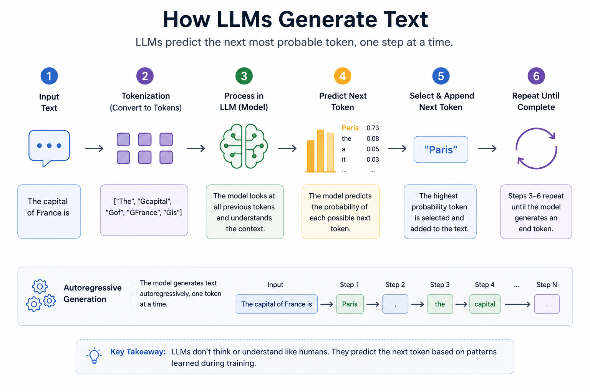

# Day 2 — How LLMs Work (Tokens, Prompts, Context)

## Objective

By the end of this lesson, you will:
- Understand how LLMs generate text
- Learn what tokens are and why they matter
- Understand prompts and prompt structure
- Learn about context windows and their limitations
- See how this connects directly to RAG

---

## 1. How LLMs Actually Work

Large Language Models (LLMs) do not think or understand like humans.

They work by predicting the next most probable token based on previous tokens.

---

### Example

Input:
"The capital of France is"

LLM predicts:
"Paris"

This happens because:
- The model has seen similar patterns during training
- "Paris" has the highest probability in that context

---

## 2. What is a Token?

A token is the smallest unit an LLM processes.

Tokens are not always words.

They can be:
- full words
- parts of words
- punctuation

### Example

Sentence:
"I love AI"

Possible tokens:
- "I"
- " love"
- " AI"

### Important Notes

- 1 token is not equal to 1 word  
- On average:
  - 1 token is approximately 0.75 words in English

---

## 3. Why Tokens Matter

### Cost
LLMs are priced per token.

More tokens result in higher cost.

### Context Limit
LLMs can only process a limited number of tokens at once.

### Performance
Too many tokens:
- increase latency
- reduce efficiency

---

## 4. Context Window

The context window is the maximum number of tokens an LLM can process in a single request.

### Example

If a model supports 8000 tokens, the following must fit within that limit:
- prompt
- retrieved documents
- user query

### Why This Matters for RAG

You cannot:
- send an entire PDF
- send all available data

You must:
- retrieve only relevant chunks
- optimize token usage

---

## 5. Prompt as the Interface

A prompt is how you communicate with an LLM.

It typically contains:
- instructions
- context
- question

### Basic Prompt

What is machine learning?

### Structured Prompt
Answer the question clearly.
Question: What is machine learning?

### RAG Prompt
Answer using only the context below.

Context:
[retrieved text]

Question:
[user query]

---

## 6. Prompt Engineering Mistakes

### Vague Prompts
Example: "Explain this"

### No Constraints
Model may generate incorrect or hallucinated answers

### Ignoring Context
Not using retrieved information properly in RAG

### Excessively Long Prompts
- increases cost
- reduces clarity

## 7. Types of Prompts

### Instruction-Based
Example: "Summarize the following text"

### Context-Based
Provide information and ask a question

### Role-Based
Example: "You are a legal expert"

### Few-shot Prompting
Provide examples before asking the question

## 8. How LLM Generates Output

Step-by-step process:

1. Tokenize input  
2. Process tokens through the neural network  
3. Predict the next token  
4. Append the token  
5. Repeat until completion  

This process is called autoregressive generation.

---

## 9. Limitations of LLMs

### No True Understanding
Output is based on probabilities, not reasoning

### Sensitive to Prompt
Small changes can produce very different results

### No Memory by Default
Each request is independent

### Context Loss
Too much input may dilute important information

---

## 10. Connection to RAG

### Problem
- LLMs have limited context
- Cannot access external data

### RAG Solution
- Retrieve relevant chunks
- Inject them into the prompt
- Stay within context limits

Key idea:
RAG improves performance by optimizing the input given to the model.

---

## 11. Key Insight

LLM performance depends on:
- prompt quality
- context relevance
- efficient token usage

---

## 12. Interview Questions

### Basic
1. What is a token?  
2. What is a context window?  

### Intermediate
3. How do tokens affect cost?  
4. What is prompt engineering?
   
### Advanced
5. Why is context window important in RAG?  
6. How would you optimize prompt size?  

---

## Next Step

Day 3: Embeddings — how text is converted into vectors for retrieval.
