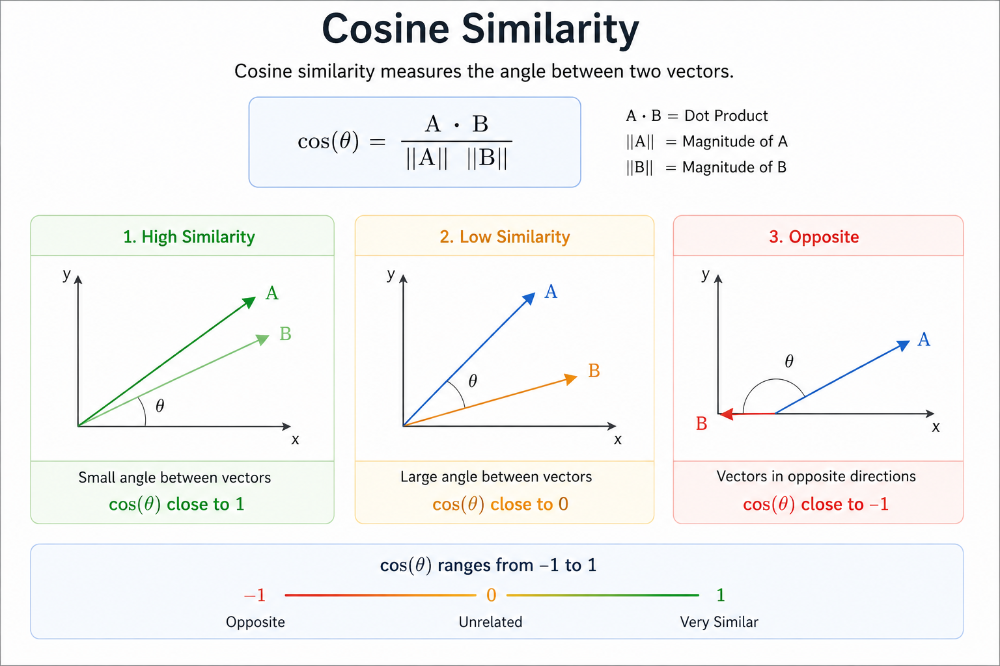

# Day 4 — Similarity Search (Cosine Similarity)

## Objective

By the end of this lesson, you will:
- Understand how similarity between vectors is calculated
- Learn cosine similarity with intuition
- Understand how retrieval works internally in RAG
- Implement similarity search in Python
- Visualize the retrieval flow

---

## 1. Why Similarity Matters in RAG

In a RAG system, the most important step is:

How do we find the most relevant information for a query?

We cannot compare raw text directly because:
- Text is unstructured
- Exact keyword matching fails for semantic meaning

Instead, we:
1. Convert text → embeddings (vectors)
2. Compare vectors → similarity score
3. Retrieve most relevant results

---

## 2. From Text to Meaning

Example:

Query:
"What is AI?"

Documents:
- "Artificial Intelligence basics"
- "Machine learning introduction"
- "Cooking pasta recipe"

Even though words differ, meaning is similar.

This is why embeddings + similarity are required.

---

## 3. What is Similarity?

Similarity measures how close two vectors are in space.

- High similarity → vectors point in same direction
- Low similarity → vectors differ
- Negative similarity → opposite meaning

---

## 4. Cosine Similarity (Intuition)

Cosine similarity measures the angle between two vectors.

Instead of distance, it checks:

How aligned are these two vectors?

## Formula
cos(θ) = (A · B) / (||A|| * ||B||)

Where:
- A · B = dot product
- ||A|| = magnitude of vector A
- ||B|| = magnitude of vector B

## Intuition

Think of vectors as arrows:

- Same direction → similarity ≈ 1  
- Perpendicular → similarity ≈ 0  
- Opposite direction → similarity ≈ -1  

## 5. Visual Understanding
High Similarity (≈ 1)

A →
B →

Low Similarity (≈ 0)

A →
B ↑

Opposite (≈ -1)

A →
B ←

---

## 6. Why Cosine Similarity is Used in RAG

- Works well for high-dimensional embeddings
- Ignores magnitude (focuses on meaning)
- Fast and efficient
- Industry standard for semantic search

---

## 7. RAG Retrieval Flow (Important)
User Query
↓
Convert to Embedding
↓
Compare with Stored Embeddings
↓
Compute Cosine Similarity
↓
Rank Results
↓
Select Top-K Documents
↓
Send to LLM

---

## 8. Example Walkthrough

Query:
"What is artificial intelligence?"

Documents:
1. "AI is the simulation of human intelligence"
2. "Machine learning is a subset of AI"
3. "How to cook pasta"

Similarity Results (approx):
- Doc 1 → 0.92  
- Doc 2 → 0.85  
- Doc 3 → 0.12  

Top result → Doc 1

---

## 9. Python Implementation

Run:
python similarity_demo.py

---

## 10. What Happens Internally

Step-by-step:

1. Convert query → vector  
2. Convert documents → vectors  
3. Compute cosine similarity  
4. Get similarity scores  
5. Sort results  
6. Select highest score  

---

## 11. Key Insight

Cosine similarity is the **core of retrieval**.

Even if:
- your LLM is powerful

If similarity is wrong:
- retrieval fails
- output becomes incorrect

---

## 12. Common Mistakes

### Using raw text instead of embeddings
This breaks semantic search

### Ignoring preprocessing
Clean text improves similarity

### Wrong similarity metric
Cosine similarity is best for most NLP use cases

### Not selecting top-k properly
Too many → noise  
Too few → missing context  

---

## 13. Interview Questions

### Basic
1. What is cosine similarity?
2. Why is it used in RAG?

### Intermediate
3. How does cosine similarity differ from Euclidean distance?
4. Why do we prefer cosine similarity for embeddings?

### Advanced
5. What happens if similarity scores are incorrect?
6. How would you improve retrieval quality?

## 14. Key Takeaway

RAG performance depends heavily on:

- embedding quality
- similarity calculation
- ranking strategy

Not just the LLM.

---
## Cosine Similarity Visualization

## Next Step

Day 5: Vector Databases (FAISS) — scaling similarity search to large datasets
