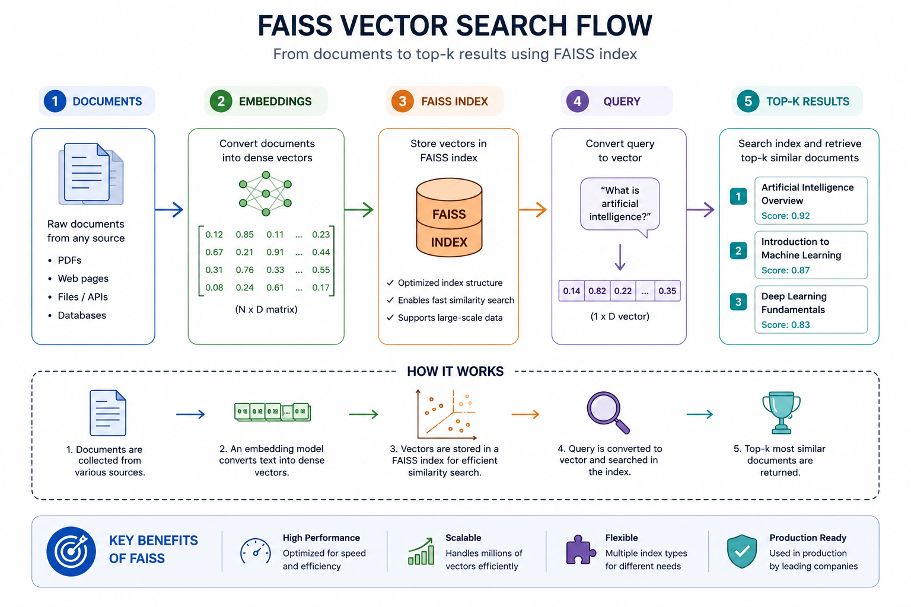

# Day 5 — Vector Search with FAISS (Scaling Similarity Search)

## Objective

This module introduces efficient vector search using FAISS and explains how large-scale retrieval systems are built for production-grade RAG pipelines.

By the end of this lesson, you will:
- Understand the limitations of naive similarity search
- Learn how vector indexing enables scalable retrieval
- Understand FAISS architecture and core concepts
- See how FAISS integrates into a RAG system
- Distinguish between FAISS and full vector databases

---

## 1. Limitations of Naive Similarity Search

In earlier stages, similarity was computed by comparing a query embedding against every document embedding.

This brute-force approach works for small datasets but does not scale.

### Challenges

- Linear scan over all vectors (O(n))
- High latency as dataset size grows
- Inefficient for real-time applications
- Poor resource utilization

As dataset size increases (thousands to millions of vectors), this approach becomes impractical.

---

## 2. Requirement for Scalable Retrieval

A production-ready system must:

- Store embeddings efficiently  
- Perform fast nearest neighbor search  
- Support large-scale datasets  
- Maintain low latency  

This is achieved through **vector indexing**.

---

## 3. Introduction to FAISS

FAISS (Facebook AI Similarity Search) is a high-performance library for similarity search and clustering of dense vectors.

It is designed to handle large collections of vectors efficiently.

### Capabilities

- Efficient storage of embeddings  
- Fast nearest neighbor search  
- Support for multiple indexing strategies  
- Optimized for CPU and GPU  

---

## 4. Core Concept: Vector Indexing

Instead of scanning every vector, FAISS builds an **index**.

An index is a data structure that organizes vectors to enable fast retrieval.

### Key idea

Rather than:

Compare query with all vectors

We use:

Search within an optimized index structure

---

## 5. Retrieval Workflow

The FAISS-based retrieval pipeline follows this flow:

1. Convert documents into embeddings  
2. Store embeddings in a FAISS index  
3. Convert query into embedding  
4. Perform nearest neighbor search  
5. Retrieve top-k similar vectors  

---

## Visual Representation

---

## 6. Distance Metrics

FAISS supports different similarity metrics:

### L2 Distance (Euclidean)
- Measures absolute distance between vectors  
- Lower distance = more similar  

### Inner Product
- Measures alignment between vectors  
- Used to approximate cosine similarity  

---

## 7. Top-K Retrieval

Instead of retrieving a single result, FAISS returns the **top-k nearest vectors**.

This enables:
- richer context  
- better downstream generation  
- improved answer quality in RAG systems  

---

## 8. FAISS in the RAG Pipeline

With FAISS, the RAG architecture becomes:

Documents → Embeddings → FAISS Index →  Query →  Top-K Retrieval →  LLM →  Generated Response  

FAISS acts as the **retrieval engine** within the pipeline.

---

## 9. Performance Considerations

FAISS improves performance by:

- Reducing search space  
- Using optimized data structures  
- Supporting approximate nearest neighbor (ANN) search  

This allows:
- faster queries  
- lower latency  
- better scalability  

---

## 10. FAISS vs Vector Databases

| Aspect | FAISS | Vector Databases |
|--------|------|------------------|
| Type | Library | Full system |
| Storage | In-memory / local | Persistent |
| Metadata support | Limited | Extensive |
| Scaling | Manual | Built-in |
| Deployment | Local | Distributed / cloud |
| Examples | FAISS | ChromaDB, Pinecone, Weaviate |

---

## 11. Role in System Design

FAISS is typically used in:

- Prototyping RAG systems  
- Local development environments  
- Research and experimentation  

For production systems, FAISS concepts are extended using vector databases that add:

- persistence  
- filtering  
- distributed scaling  

---

## 12. Common Design Considerations

When building retrieval systems:

- Choice of embedding model affects quality  
- Index type impacts performance  
- Distance metric influences relevance  
- Number of retrieved documents (k) affects output quality  

---

## 13. Key Takeaway

Efficient retrieval is the backbone of any RAG system.

Embeddings and similarity define *what* to retrieve.  
FAISS defines *how fast and efficiently* retrieval happens.

---

## Next Step

Day 6 — Data Ingestion Pipeline  
Designing how documents are processed, cleaned, and prepared for indexing
